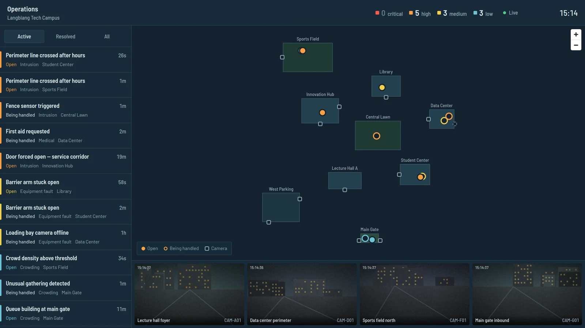
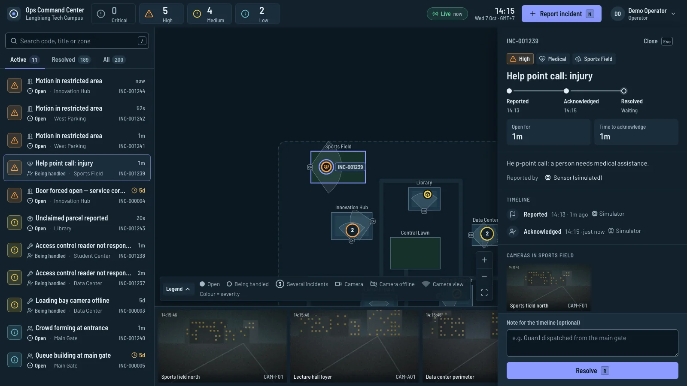
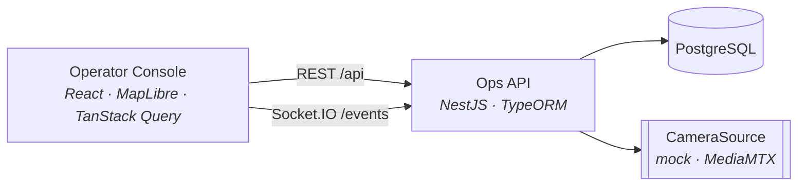

# Ops Command Center

[](https://github.com/truongtankhanh/ops-command-center/actions/workflows/ci.yml)


A real-time operations console for a campus security and facilities team: live incidents on a site map, camera tiles next to every incident, and an auditable response workflow — one screen that answers _what is happening, where, and who is handling it_.



The demo runs on **Langbiang Tech Campus**, a fictional site with synthetic incidents and simulated cameras. One command brings up the whole stack.

```bash
docker compose up --build
# Console      http://localhost:18080
# API + docs   http://localhost:13000/api/docs
```

## What it does

- **Live incident feed** — new reports appear on every open console within a second, ordered by what needs attention first: unresolved, then severity, then age.
- **Campus map** — zones, cameras and incidents on a site plan that works fully offline (on-prem friendly); a basemap can be layered underneath with one environment variable.
- **Respond and record** — acknowledge or resolve with an optional note. Every change is written to the incident's timeline, and invalid transitions are rejected by the server.
- **Cameras in context** — the cameras covering an incident's zone come first, rendered through a source-agnostic stream descriptor (mock feeds now, RTSP via MediaMTX next).
- **Demo traffic** — a simulator reports, acknowledges and resolves incidents through the same service an operator uses, so the demo exercises the real rules.



## Architecture



```
apps/
  api/              NestJS — REST, WebSocket gateway, migrations, seed, simulator
  console/          React + Vite — feed, map, detail, camera tiles
packages/
  contracts/        Shared types + event names: the API ↔ console contract
  camera-adapter/   CameraSource port with mock and MediaMTX implementations
docs/
  api/              API reference + OpenAPI 3.1, generated from code and drift-checked
  architecture.md   System design, domain model, real-time flow
  adr/              Architecture Decision Records
  roadmap.md        Milestones and ticket breakdown
```

The full design is in [docs/architecture.md](docs/architecture.md); every endpoint and event is documented in [docs/api](docs/api/README.md). Key decisions, each with context, options and consequences:

| ADR                                                      | Decision                                                                                            |
| -------------------------------------------------------- | --------------------------------------------------------------------------------------------------- |
| [0001](docs/adr/0001-monorepo-pnpm-turborepo.md)         | Monorepo with pnpm workspaces and Turborepo — a contract change and both sides of it land in one PR |
| [0002](docs/adr/0002-camera-source-adapter.md)           | Cameras behind a `CameraSource` adapter — mock in dev/CI, MediaMTX in production, chosen by config  |
| [0003](docs/adr/0003-realtime-domain-events-socketio.md) | Domain events emitted after commit, broadcast by a Socket.IO gateway that only listens              |
| [0004](docs/adr/0004-postgres-typeorm-migrations.md)     | PostgreSQL + TypeORM, migrations only, applied at boot                                              |

### Design details worth a look

- **Type-safe contract end to end.** `packages/contracts` defines the domain types and the WebSocket event map. The API's OpenAPI DTOs `implement` those interfaces and both socket ends are typed with the same event map, so a renamed field or event fails to compile on both sides.
- **Lifecycle rules live in the entity.** `IncidentEntity.acknowledge()` / `resolve()` enforce transitions and append timeline events; the service only orchestrates. Domain errors map to HTTP status codes in one exception filter.
- **Concurrency-safe transitions.** Status changes run in a transaction with a row lock (`SELECT … FOR UPDATE`), so two operators cannot both acknowledge the same incident. Codes like `INC-000042` come from a database sequence.
- **Events after commit, cache patching on the client.** Consoles update the TanStack Query cache from event payloads instead of refetching, and refetch once on reconnect to converge.
- **The simulator is a client, not a backdoor.** It goes through `IncidentsService` like an operator, so demo data never bypasses validation, persistence or events.

## Running locally

Requirements: Node 24, pnpm 10, PostgreSQL 16+ (or use the `postgres` service from Compose).

```bash
pnpm install
cp apps/api/.env.example apps/api/.env      # point DATABASE_URL at your database
docker compose up -d postgres               # optional: a local database on 127.0.0.1:15432

pnpm dev                                     # API on :13000, console on :15173
```

The Compose `postgres` service listens on `127.0.0.1` only. If port 15432 is taken, start it with `POSTGRES_PORT=15433 docker compose up -d postgres` and use the same port in `DATABASE_URL`.

The console's dev server proxies `/api` and `/socket.io` to the API, exactly as nginx does in the container — no CORS configuration anywhere. It finds the API through `API_URL` (default `http://localhost:13000`).

API configuration (`apps/api/.env`):

| Variable                                   | Default | Purpose                                                                |
| ------------------------------------------ | ------- | ---------------------------------------------------------------------- |
| `PORT`                                     | `3000`  | HTTP and WebSocket port (`.env.example` sets `13000` for `pnpm dev`)   |
| `DATABASE_URL`                             | —       | PostgreSQL connection string                                           |
| `SEED_ON_BOOT`                             | `true`  | Seed the reference campus when the database is empty                   |
| `SIMULATOR_ENABLED`                        | `false` | Generate demo incident traffic (`.env.example` and Compose turn it on) |
| `SIMULATOR_INTERVAL_MS`                    | `8000`  | Time between simulator ticks                                           |
| `CAMERA_SOURCE`                            | `mock`  | `mock` or `mediamtx`                                                   |
| `MEDIAMTX_HLS_URL` / `MEDIAMTX_WEBRTC_URL` | —       | Media server endpoints when `CAMERA_SOURCE=mediamtx`                   |
| `MEDIAMTX_PROTOCOL`                        | `hls`   | `hls` or `webrtc`                                                      |

The API validates its configuration at startup and refuses to boot with a clear message when something is wrong.

With `docker compose up`, `SEED_ON_BOOT`, `CAMERA_SOURCE`, `SIMULATOR_ENABLED`, `SIMULATOR_INTERVAL_MS` and `POSTGRES_PORT` can be overridden from the shell or a root `.env` file.

## Quality

```bash
pnpm lint          # ESLint (flat config) across the monorepo
pnpm typecheck     # strict TypeScript everywhere
pnpm test          # unit tests: domain rules, error mapping, adapters, console logic and components
pnpm test:e2e      # API against a real PostgreSQL: migrations, seed, lifecycle, validation, WebSocket events
pnpm build
```

CI runs all of the above on every push and pull request, then builds both Docker images.

## Roadmap

M1 (this release) delivers the full loop with synthetic data. Next: real video through MediaMTX and a heatmap layer (M2), a read-only video-wall app and OIDC roles (M3), then observability and SLA escalation (M4). Ticket-level breakdown in [docs/roadmap.md](docs/roadmap.md).

## License

[MIT](LICENSE) © Trương Tấn Khánh
