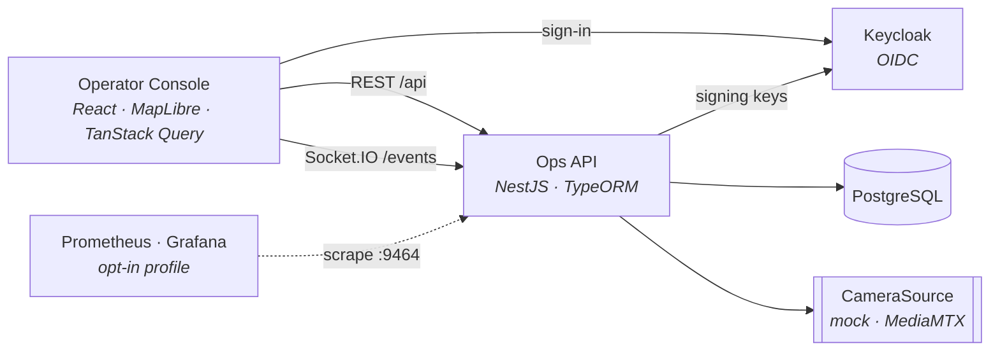

# Ops Command Center

[](https://github.com/truongtankhanh/ops-command-center/actions/workflows/ci.yml)


A real-time operations console for a campus security and facilities team: live incidents on a site map, camera tiles next to every incident, and an auditable response workflow — one screen that answers _what is happening, where, and who is handling it_.


The demo runs on **Langbiang Tech Campus**, a fictional site with synthetic incidents and simulated cameras. One command brings up the whole stack.

```bash
docker compose up --build
# Console      http://localhost:18080
# API + docs   http://localhost:18080/api/docs   (read-only; off by default in production — ADR-0005)
```

Sign in as `operator`, `supervisor` or `viewer`; each password is the username. They are demo users of the bundled Keycloak realm (`ops/keycloak/occ-realm.json`), which is for the demo only: a real deployment uses its own identity provider ([ADR-0010](docs/adr/0010-oidc-authentication.md)). `operator` and `supervisor` may report, acknowledge and resolve incidents; `viewer` is read-only, and every timeline entry shows who made it ([ADR-0011](docs/adr/0011-role-based-authorization-and-timeline-actor.md)).

The API can run as several replicas behind the console's nginx. Every console sees every change, whichever replica made it, and only one replica runs the simulator:

```bash
docker compose up --build --scale api=2
```

To check it, open the console in two browser windows and acknowledge an incident in one: it updates in the other within a second. With round-robin, the two windows are usually on different replicas (`docker compose logs api` shows which replica each console connected to, from the gateway's debug-level connection log).

The demo is sized for two replicas. Each holds a pool of 10 database connections, so beyond about eight replicas the default PostgreSQL `max_connections` of 100 runs out.

Metrics and a Grafana dashboard come with an opt-in profile ([ADR-0015](docs/adr/0015-metrics-and-tracing.md)):

```bash
docker compose --profile observability up --build --scale api=2
# Grafana      http://localhost:13001   (read-only without signing in; dashboard "OCC API")
```

The dashboard shows commit-to-broadcast delivery latency against the one-second goal, connected consoles, HTTP rate, errors and latency per route, and process health, one environment at a time. Prometheus scrapes every replica on port 9464 over the Compose network. That port is published nowhere and nginx never proxies it.

## What it does

- **Live incident feed** — new reports appear on every open console within a second, ordered by what needs attention first: unresolved, then severity, then age.
- **Campus map** — zones, cameras and incidents on a site plan that works fully offline (on-prem friendly); a basemap can be layered underneath with one environment variable.
- **Respond and record** — acknowledge or resolve with an optional note. Every change is written to the incident's timeline, and invalid transitions are rejected by the server.
- **Cameras in context** — the cameras covering an incident's zone come first, rendered through a source-agnostic stream descriptor (mock feeds now, RTSP via MediaMTX next).
- **Demo traffic** — a simulator reports, acknowledges and resolves incidents through the same service an operator uses, so the demo exercises the real rules.


## Architecture



```
apps/
  api/              NestJS — REST, WebSocket gateway, migrations, seed, simulator
  console/          React + Vite — feed, map, detail, camera tiles
packages/
  contracts/        Shared types + event names: the API ↔ console contract
  camera-adapter/   CameraSource port with mock and MediaMTX implementations
ops/
  keycloak/         Demo realm, re-imported on every start
  prometheus/       Scrape config: every API replica on its metrics port
  grafana/          Provisioned datasource and the "OCC API" dashboard
docs/
  api/              API reference + OpenAPI 3.0, generated from code and drift-checked
  architecture.md   System design, domain model, real-time flow
  adr/              Architecture Decision Records
  roadmap.md        Milestones and ticket breakdown
```

The full design is in [docs/architecture.md](docs/architecture.md); every endpoint and event is documented in [docs/api](docs/api/README.md). Key decisions, each with context, options and consequences:

| ADR                                                                        | Decision                                                                                                                                                         |
| -------------------------------------------------------------------------- | ---------------------------------------------------------------------------------------------------------------------------------------------------------------- |
| [0001](docs/adr/0001-monorepo-pnpm-turborepo.md)                           | Monorepo with pnpm workspaces and Turborepo — a contract change and both sides of it land in one PR                                                              |
| [0002](docs/adr/0002-camera-source-adapter.md)                             | Cameras behind a `CameraSource` adapter — mock in dev/CI, MediaMTX in production, chosen by config                                                               |
| [0003](docs/adr/0003-realtime-domain-events-socketio.md)                   | Domain events on an in-process bus, broadcast by a Socket.IO gateway that only listens (delivery amended by 0007)                                                |
| [0004](docs/adr/0004-postgres-typeorm-migrations.md)                       | PostgreSQL + TypeORM, migrations only, applied at boot                                                                                                           |
| [0005](docs/adr/0005-api-docs-exposure-per-environment.md)                 | Swagger UI on in development, off in production unless explicitly enabled — and then read-only                                                                   |
| [0006](docs/adr/0006-config-and-secrets-per-environment.md)                | One validated config path; tests isolated from dev data; production refuses demo defaults; secrets injected by the platform                                      |
| [0007](docs/adr/0007-transactional-outbox.md)                              | Transactional outbox — an event commits with its change and a relay publishes it; at-least-once, ordered by `version` on the client                              |
| [0008](docs/adr/0008-multi-replica-fan-out.md)                             | Several API replicas: Postgres `NOTIFY` fans every event out to all of them; one simulator leader; boot serialised by advisory locks                             |
| [0009](docs/adr/0009-idempotent-incident-creation.md)                      | `Idempotency-Key` on incident creation — a retried report replays the first response instead of creating a duplicate                                             |
| [0010](docs/adr/0010-oidc-authentication.md)                               | OIDC sign-in through a self-hosted Keycloak; every request and socket carries an access token checked by the API                                                 |
| [0011](docs/adr/0011-role-based-authorization-and-timeline-actor.md)       | Permissions per role (`viewer` read-only), checked by the API; every timeline entry records its actor                                                            |
| [0012](docs/adr/0012-rate-limiting.md)                                     | Rate limits per IP in nginx and per user and route in the API, counted in PostgreSQL across replicas                                                             |
| [0013](docs/adr/0013-liveness-and-readiness-probes.md)                     | Liveness checks the process only, readiness the database and this replica's `LISTEN`; Docker probes liveness                                                     |
| [0014](docs/adr/0014-structured-logging-and-correlation.md)                | JSON logs with redaction; one `requestId` from nginx through the outbox to every replica; log level raised at runtime with a TTL                                 |
| [0015](docs/adr/0015-metrics-and-tracing.md)                               | Prometheus metrics on a port of its own that nginx never proxies; bounded labels; tracing deferred with its sampling recorded                                    |
| [0016](docs/adr/0016-console-css-modules.md)                               | Console styles in CSS Modules per component; only tokens and element defaults are global; variants are attributes, not classes                                   |
| [0017](docs/adr/0017-site-plan-as-data.md)                                 | The site plan and camera fields of view are data served by the API, so a site's geometry changes without a console build                                         |
| [0018](docs/adr/0018-assets-and-telemetry-as-domain-data.md)               | Equipment, its telemetry points and threshold rules are catalogue data in PostgreSQL; a sustained breach becomes an ordinary incident linked to its asset        |
| [0019](docs/adr/0019-telemetry-transport.md)                               | Telemetry reaches only the API over MQTT and goes to consoles on a best-effort `/telemetry` Socket.IO namespace with the same tokens; the broker is never public |
| [0020](docs/adr/0020-digital-twin-rendering-and-model-pipeline.md)         | The 3D twin renders with three.js in a lazy console chunk; models are budgeted, content-hashed `.glb` files whose named parts move with readings                 |
| [0021](docs/adr/0021-incident-categories-zone-uses-and-technician-role.md) | Incident types grouped in six categories, zones carry a building use, and a `technician` role acts only on Facilities and Environment incidents                  |

### Design details worth a look

- **Type-safe contract end to end.** `packages/contracts` defines the domain types and the WebSocket event map. The API's OpenAPI DTOs `implement` those interfaces and both socket ends are typed with the same event map, so a renamed field or event fails to compile on both sides.
- **Lifecycle rules live in the entity.** `IncidentEntity.acknowledge()` / `resolve()` enforce transitions and append timeline events; the service only orchestrates. Domain errors map to HTTP status codes in one exception filter.
- **Concurrency-safe transitions.** Status changes run in a transaction with a row lock (`SELECT … FOR UPDATE`), so two operators cannot both acknowledge the same incident. Codes like `INC-000042` come from a database sequence.
- **Events through a transactional outbox, cache patching on the client.** Each change writes its event in the same transaction, and a relay publishes it, so a crash between commit and broadcast cannot lose it. Postgres `LISTEN/NOTIFY` hands every event to every API replica, so it reaches consoles on all of them, with no broker to run. Consoles update the TanStack Query cache from event payloads instead of refetching, ignore duplicates and stale copies by `version`, and refetch once on reconnect to converge.
- **One change, one ID, end to end.** The `requestId` nginx sets (or the API generates) is echoed to the client, stored with the outbox row and restored on every replica that broadcasts it, so nginx's access line, the API's request log and anything logged while delivering that change, on any replica, share one ID.
- **The one-second promise is measured.** `incident_event_delivery_seconds` times each event from its outbox row to its broadcast, on every replica; the dashboard plots p50/p95/p99 against the goal.
- **The simulator is a client, not a backdoor.** It goes through `IncidentsService` like an operator, so demo data never bypasses validation, persistence or events.

## Running locally

Requirements: Node 24, pnpm 10, PostgreSQL 17 (or use the `postgres` service from Compose).

```bash
pnpm install
cp apps/api/.env.example apps/api/.env      # point DATABASE_URL at your database
docker compose up -d postgres keycloak      # database on 127.0.0.1:15432, sign-in on 127.0.0.1:18081

pnpm dev                                     # API on :13000 (metrics on :9464), console on :15173
```

The Compose `postgres` and `keycloak` services listen on `127.0.0.1` only. If port 15432 is taken, start them with `POSTGRES_PORT=15433` and use the same port in `DATABASE_URL`; if 18081 is taken, use `KEYCLOAK_PORT`, change the port in `OIDC_JWKS_URL`, and start the console with `KEYCLOAK_URL` pointing at it. The API refuses to start without the `OIDC_*` variables, so copy them from `.env.example` into an existing `.env`.

The console's dev server proxies `/api` and `/socket.io` to the API and `/auth` to Keycloak, exactly as nginx does in the container — no CORS configuration anywhere. It finds the API through `API_URL` (default `http://localhost:13000`) and Keycloak through `KEYCLOAK_URL` (default `http://localhost:18081`). Sign-in therefore happens on `:15173`, the issuer `apps/api/.env.example` expects.

An optional basemap under the campus plan comes from `VITE_MAP_STYLE_URL` (a MapLibre style URL), which the dev server reads from `apps/console/.env` (copy `apps/console/.env.example`; unset, the console shows the offline plan only). It is a build-time value and does not reach the Compose image: `.dockerignore` keeps every `.env` file out of the build, and the Dockerfile takes no build arguments.

API configuration (`apps/api/.env`):

| Variable                                   | Default                       | Purpose                                                                                         |
| ------------------------------------------ | ----------------------------- | ----------------------------------------------------------------------------------------------- |
| `NODE_ENV`                                 | — (required)                  | `development`, `test` or `production` (Jest sets `test`, the Docker image sets `production`)    |
| `PORT`                                     | `3000`                        | HTTP and WebSocket port (`.env.example` sets `13000` for `pnpm dev`)                            |
| `METRICS_PORT`                             | `9464`                        | Prometheus `GET /metrics` on a listener of its own; must differ from `PORT`; never public       |
| `LOG_LEVEL`                                | `debug`, `info` in production | Lowest level logged (`warn` in tests); raise it at runtime with `log-level` (ADR-0014)          |
| `DEPLOYMENT_ENV`                           | `local`, none in production   | Environment label (`env`) on every log line and metric; staging and production must set it      |
| `TRUST_PROXY_HOPS`                         | `1`                           | Proxy hops trusted for the client address (nginx); `0` if the API port is exposed (ADR-0012)    |
| `RATE_LIMIT_ENABLED`                       | `true`                        | Per-user rate limits; may be `false` in development and test, never in production (ADR-0012)    |
| `DATABASE_URL`                             | —                             | PostgreSQL connection string (`postgres://` or `postgresql://`)                                 |
| `API_DOCS_ENABLED`                         | on, off in production         | Serve Swagger UI and the raw spec at `/api/docs` (ADR-0005)                                     |
| `SEED_ON_BOOT`                             | `true`, `false` in production | Seed the reference campus when the database is empty; production needs `DEMO_MODE` to enable it |
| `SIMULATOR_ENABLED`                        | `false`                       | Generate demo incident traffic (`.env.example` and Compose turn it on)                          |
| `SIMULATOR_INTERVAL_MS`                    | `8000`                        | Time between simulator ticks                                                                    |
| `CAMERA_SOURCE`                            | `mock`, none in production    | `mock` or `mediamtx`; production must set it, and `mock` needs `DEMO_MODE`                      |
| `MEDIAMTX_HLS_URL` / `MEDIAMTX_WEBRTC_URL` | —                             | Media server endpoints when `CAMERA_SOURCE=mediamtx`                                            |
| `MEDIAMTX_PROTOCOL`                        | `hls`                         | `hls` or `webrtc`                                                                               |
| `DEMO_MODE`                                | `false`                       | Lets a `production` deploy use mock cameras and seeding; only the Compose demo sets it          |
| `OIDC_ISSUER`                              | — (required)                  | Expected token issuer, as the browser reaches it; production needs `https` unless `DEMO_MODE`   |
| `OIDC_JWKS_URL`                            | — (required)                  | Where the API fetches the issuer's signing keys; may be an internal address                     |
| `OIDC_AUDIENCE`                            | — (required)                  | Expected token audience (`occ-api` in the demo realm)                                           |

The API validates its configuration at startup and refuses to boot with a clear message when something is wrong. It reads `apps/api/.env` whatever the working directory, and a variable set in the environment always wins over the file. Configuration is fixed for the life of the process. How each environment, staging and production included, gets its values: [ADR-0006](docs/adr/0006-config-and-secrets-per-environment.md).

With `docker compose up`, `SEED_ON_BOOT`, `CAMERA_SOURCE`, `SIMULATOR_ENABLED`, `SIMULATOR_INTERVAL_MS`, `DEMO_MODE`, `DEPLOYMENT_ENV` (`demo`), `API_DOCS_ENABLED`, `POSTGRES_PORT`, `POSTGRES_PASSWORD` (URL-safe, applied only when the `pgdata` volume is created), `KEYCLOAK_PORT`, `CONSOLE_BIND`, `OCC_PUBLIC_URL`, `GRAFANA_PORT` and `GRAFANA_ADMIN_PASSWORD` (demo only) can be overridden from the shell or a root `.env` file. There, `CAMERA_SOURCE` accepts only `mock` until the MediaMTX service (OCC-15) lands, because Compose does not pass the `MEDIAMTX_*` URLs to the API.

The console listens on `127.0.0.1:18080` only, like Postgres and Keycloak: the demo users' passwords are their usernames, so a console reachable from the network lets anyone on it sign in. To open it from another machine, set both `CONSOLE_BIND=0.0.0.0` and `OCC_PUBLIC_URL` (the address that machine uses, e.g. `http://192.168.1.20:18080`), and only on a network you trust.

The console's nginx is the only way into the API, and it decides the client address that rate limits use ([ADR-0012](docs/adr/0012-rate-limiting.md)). In Compose it is the edge. If a load balancer or TLS terminator sits in front of it, mount `/etc/nginx/conf.d/real-ip.conf` into the `console` container with `set_real_ip_from <LB CIDR>; real_ip_header X-Forwarded-For; real_ip_recursive on;`, listing only that load balancer's addresses. Keep `TRUST_PROXY_HOPS=1` on the API either way.

## Operations

**Logs.** The API writes one JSON object per line to stdout, with `service`, `env`, `version` and, inside a request or a background job, `requestId`; `pnpm dev` renders the same objects through `pino-pretty`. Every response carries the `X-Request-Id` it ran under, so a user or support can quote it, and `docker compose logs | grep <id>` finds nginx's access line, the API's request log and any line logged while delivering that change on any replica (a failed delivery, for instance). Tokens, passwords, connection strings, emails and display names are redacted in every environment ([ADR-0014](docs/adr/0014-structured-logging-and-correlation.md)).

**Log level at runtime.** Raise the level on every replica for a while, without a restart. The change expires by itself and records who made it:

```bash
pnpm --filter @occ/api log-level set debug --ttl 30 --by "jane / INC-123"     # development
docker compose exec api node dist/logging/log-level.cli.js set debug --ttl 30 --by "jane / INC-123"
pnpm --filter @occ/api log-level show                                          # or: clear
```

**Health probes.** `GET /api/health/live` answers while the process serves HTTP and never checks a dependency; the Docker `HEALTHCHECK` uses it. `GET /api/health/ready` also needs the database and this replica's `LISTEN` connection. Both are public, never rate-limited, and left out of the request log and the metrics ([ADR-0013](docs/adr/0013-liveness-and-readiness-probes.md)).

**Metrics.** Each replica serves Prometheus metrics at `GET /metrics` on `METRICS_PORT` (9464), a listener apart from the API: nginx never proxies it, so keep it on an internal network. It exposes HTTP request rate, status codes and latency per route template, commit-to-broadcast delivery latency (`incident_event_delivery_seconds`), connected consoles per replica, and Node.js process metrics, each labelled `service` and `env`. `docker compose --profile observability up` adds Prometheus and the Grafana dashboard ([ADR-0015](docs/adr/0015-metrics-and-tracing.md)). There is no tracing yet; its design and sampling per environment are recorded in the same ADR.

## Quality

```bash
pnpm format:check  # Prettier
pnpm lint          # ESLint (flat config) across the monorepo
pnpm typecheck     # strict TypeScript everywhere
pnpm test          # unit tests: domain rules, error mapping, adapters, console logic and components
pnpm test:e2e      # API against a real PostgreSQL: migrations, seed, lifecycle, auth and roles, idempotency, rate limits, two instances, WebSocket events, metrics
pnpm build
```

`pnpm test:e2e` never reads `apps/api/.env`. It uses `apps/api/.env.test`, and it refuses to run against a database whose name does not end in `_test`, because it drops and rebuilds the schema. One-off setup:

```bash
cp apps/api/.env.test.example apps/api/.env.test
docker compose exec postgres createdb -U postgres ops_test
```

CI runs all of the above on every push and pull request, then builds both Docker images, boots the stack with two API replicas and checks that both are healthy behind nginx, that each serves metrics on a port the edge cannot reach, that nginx rate-limits the edge, and that each replica stays live but reports not ready while the database is stopped.

## Roadmap

M1 delivers the full loop with synthetic data. Since then, OIDC sign-in with roles and an audited timeline (OCC-21, OCC-22), structured logging with correlation IDs (OCC-23) and Prometheus metrics with a Grafana dashboard (OCC-24) have landed. Next: real video through MediaMTX and a heatmap layer (M2), a read-only video-wall app (M3), and an end-to-end console smoke test and SLA escalation (M4). Ticket-level breakdown in [docs/roadmap.md](docs/roadmap.md).

## License

[MIT](LICENSE) © Trương Tấn Khánh
