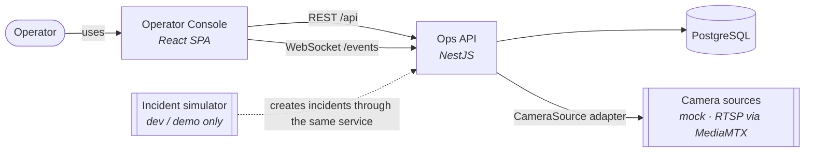
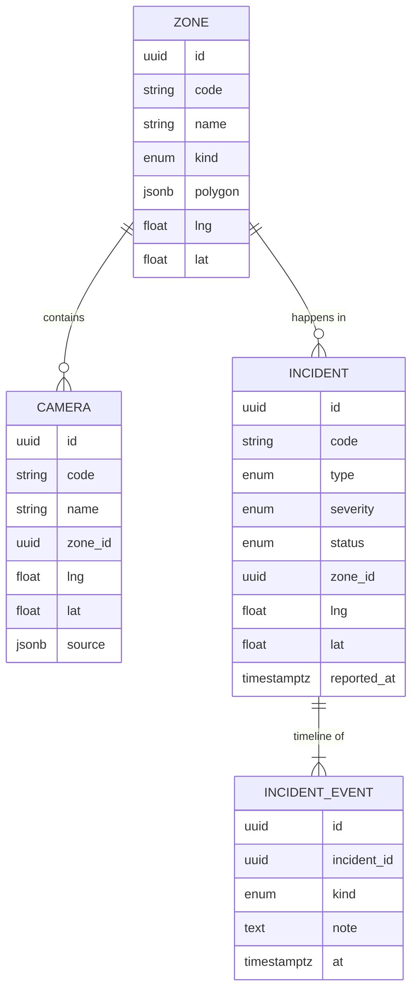
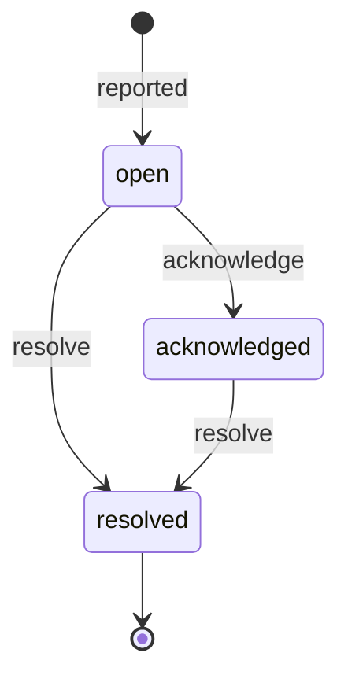
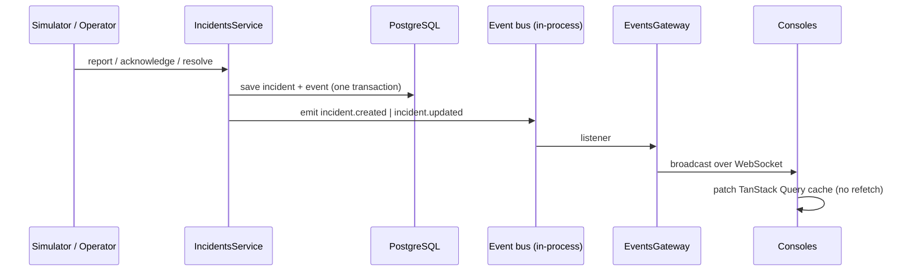

# Architecture

> Status: **M1 — Foundation**. This document describes the system as built and is updated with every milestone.

## 1. Problem

A campus operations team needs one screen that answers three questions at any moment:

1. **What is happening right now?** — open incidents, ordered by severity and age
2. **Where is it?** — on a map of the campus, next to the cameras that can see it
3. **Who is handling it?** — acknowledged, resolved, and the timeline of every change

The reference scenario is **Langbiang Tech Campus**, a fictional technology campus with buildings, parking, gates and outdoor areas. All data is synthetic.

### Quality goals

| Goal                  | What it means here                                                                                           |
| --------------------- | ------------------------------------------------------------------------------------------------------------ |
| **Live**              | A new incident reaches every open console in under a second, without refresh                                 |
| **Swappable sources** | Mock cameras in development, real RTSP/ONVIF cameras in production — same code path, chosen by configuration |
| **Auditable**         | Every state change of an incident is recorded with a timestamp; transitions are validated server-side        |
| **Runs anywhere**     | One `docker compose up` brings up the full stack on a single on-prem machine; no cloud dependency            |

## 2. Context



## 3. Containers & packages

The repository is a **pnpm + Turborepo monorepo**. Apps are deployable units; packages are shared code with a single responsibility.

```
apps/
  api/               NestJS — REST, WebSocket gateway, persistence, simulator
  console/           React + Vite — operator console (map, feed, detail, camera tiles)
packages/
  contracts/         Shared types and event names: the API ↔ console contract
  camera-adapter/    CameraSource interface + implementations (mock now, MediaMTX next)
docs/
  architecture.md    This document
  adr/               Architecture Decision Records
  roadmap.md         Milestones and ticket breakdown
```

Dependency rule: **apps depend on packages, never on each other; packages never depend on apps.** `contracts` has no runtime dependencies at all.

## 4. Domain model



### Incident lifecycle



Transitions live in the `Incident` entity itself (`acknowledge()`, `resolve()`), not in controllers. An invalid transition throws a domain error, mapped to **HTTP 409 Conflict**. Every successful transition appends an `IncidentEvent`, so the timeline is the audit log.

## 5. Real-time flow



- The service never knows about WebSockets. It emits a domain event; the gateway is one listener among potentially many (notifications, metrics…). See [ADR-0003](adr/0003-realtime-domain-events-socketio.md).
- Events are emitted **after** the transaction commits, so a console never sees an incident that was rolled back.
- On reconnect, the console refetches once to recover anything missed while offline.

## 6. Camera sources

```ts
interface CameraSource {
  readonly kind: string;
  resolveStream(camera: CameraRef): Promise<StreamDescriptor>;
}
```

The API resolves a camera to a `StreamDescriptor` (`{ kind: 'mock' }` today, `{ kind: 'hls' | 'webrtc', url }` with MediaMTX). The console renders whatever descriptor it receives. Switching from mock to real cameras is an environment change (`CAMERA_SOURCE=mediamtx`), not a code change. See [ADR-0002](adr/0002-camera-source-adapter.md).

## 7. Deployment

The repository ships a Docker Compose stack for demos and evaluation, not a production deployment. It runs on a single host: `postgres`, `api`, `console` (static build served by nginx, which also reverse-proxies `/api` and `/socket.io` — the transport for the `/events` namespace — to the API; one origin, no CORS). On boot the API runs pending migrations and seeds the reference campus when the database is empty.

A production deployment guide is not published yet.

## 8. Cross-cutting concerns

| Concern        | Approach                                                                           |
| -------------- | ---------------------------------------------------------------------------------- |
| Configuration  | `@nestjs/config`, validated at startup — the API refuses to boot with invalid env  |
| Validation     | `class-validator` DTOs + global `ValidationPipe` (whitelist, forbid unknown)       |
| Errors         | Domain errors mapped to HTTP status in one exception filter; consistent error body |
| Schema changes | TypeORM migrations only; `synchronize` is never enabled                            |
| API docs       | OpenAPI generated from code at `/api/docs`                                         |
| Quality gates  | ESLint, typecheck, unit + e2e tests and build on every push (GitHub Actions)       |

## 9. Decisions

| ADR                                                 | Decision                                           |
| --------------------------------------------------- | -------------------------------------------------- |
| [0001](adr/0001-monorepo-pnpm-turborepo.md)         | Monorepo with pnpm workspaces and Turborepo        |
| [0002](adr/0002-camera-source-adapter.md)           | Camera access behind a `CameraSource` adapter      |
| [0003](adr/0003-realtime-domain-events-socketio.md) | Domain events in-process, broadcast with Socket.IO |
| [0004](adr/0004-postgres-typeorm-migrations.md)     | PostgreSQL with TypeORM, migrations only           |
